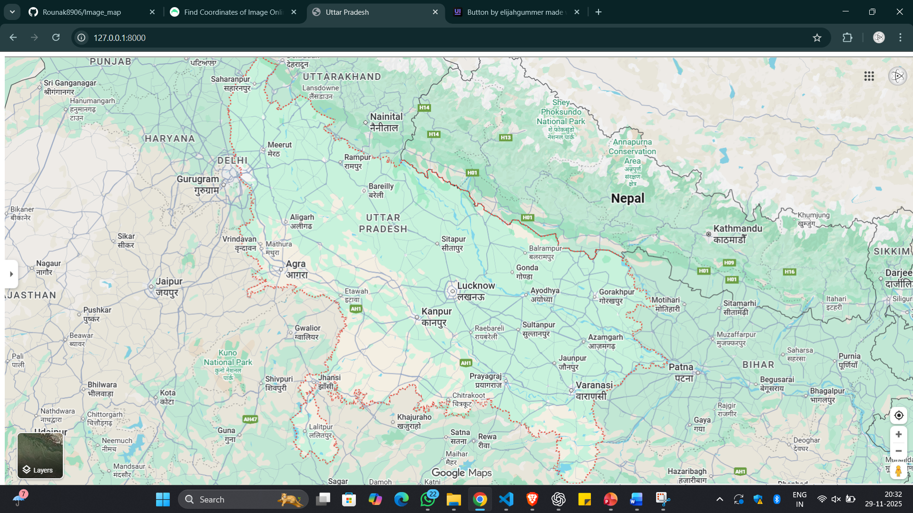
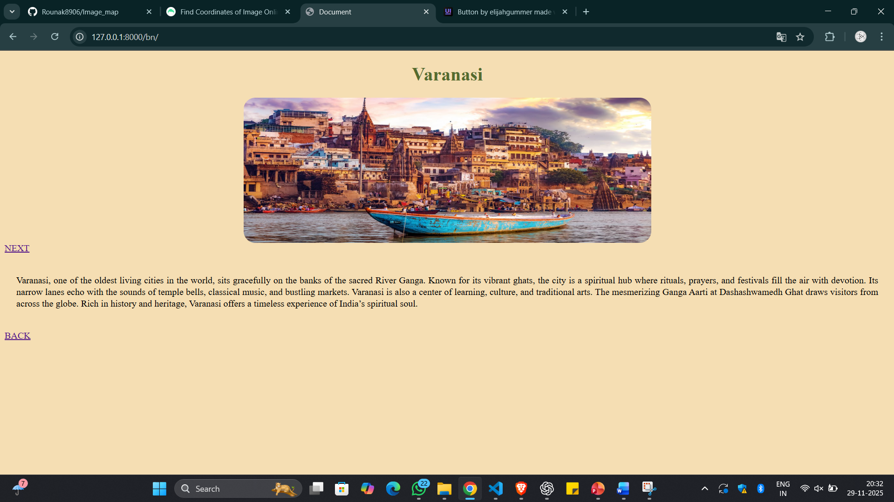
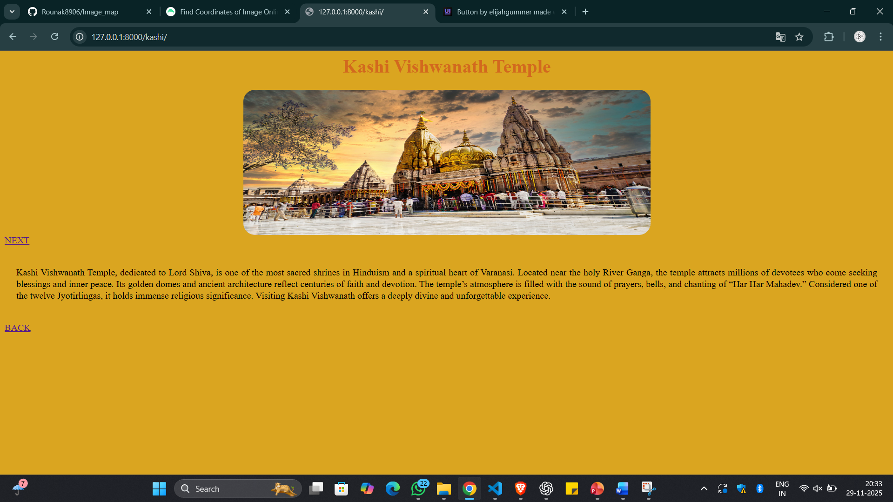
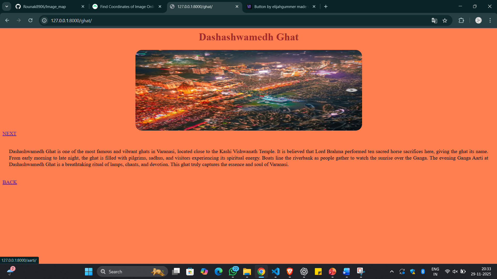
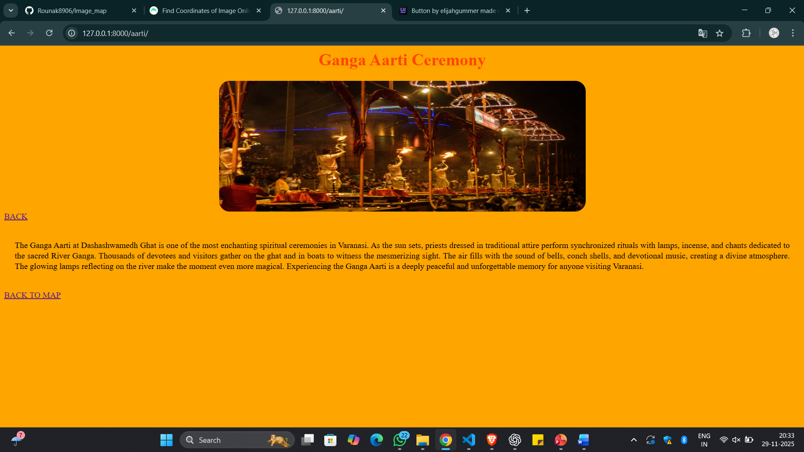

# Ex04 Places Around Me
# Date:29.11.2025
# AIM
To develop a website to display details about the places around my house.

# DESIGN STEPS
## STEP 1
Create a Django admin interface.

## STEP 2
Download your city map from Google.

## STEP 3
Using <map> tag name the map.

## STEP 4
Create clickable regions in the image using <area> tag.

## STEP 5
Write HTML programs for all the regions identified.

## STEP 6
Execute the programs and publish them.

# CODE
views.py
```
from django.shortcuts import render

def home(request):
    return render(request, 'up.html')

def bn(request):
    return render(request, 'varanasi.html')

def kashi(request):
    return render(request, 'kashivishwanath.html')

def ghat(request):
    return render(request, 'dhasashwamedhghat.html')

def aarti(request):
    return render(request, 'gangaaarti.html')
```
urls.py
```
from django.contrib import admin
from django.urls import path
from image_map import views

urlpatterns = [
    path('admin/', admin.site.urls),
    path('', views.home, name='home'),
    path('bn/', views.bn, name='bn'),
    path('kashi/', views.kashi, name='kashi'),
    path('ghat/', views.ghat, name='ghat'),
    path('aarti/', views.aarti, name='aarti'),
]
```
html files
1.
```

<html>
<head>
    <title>Uttar Pradesh</title>
    <style>

        img{
            
             background-size: cover;
             background-position: center;
             background-repeat: no-repeat;
             height: 100vh;
        }
        body{
            overflow: hidden;
        }
    </style>
</head>
<body>
   
    
    <map name="imap">
        <area shape="rect" coords="804,520,1038,783" href="" title="Up">

    </map>

```
2.
```

<!DOCTYPE html>
<html lang="en">
<head>
    <meta charset="UTF-8">
    <meta name="viewport" content="width=device-width, initial-scale=1.0">
    <title>Document</title>
    <style>
        h1{text-align:center;color:darkolivegreen;}
        img{
            display:block;
            margin-left:auto;
            margin-right:auto;
            width:700px;
            height:250px;
            border-radius: 20px;
        }
        p{
            text-align: justify;
            line-height: 20px;
            padding: 20px;

        }
        
         body {
        background-color:wheat;
        }
</style>


    </style>
</head>
<body>
    <h1>
        Varanasi
    </h1>
    
    <a href="">NEXT</a>
    
    <p>Varanasi, one of the oldest living cities in the world, sits gracefully on the banks of the sacred River Ganga. Known for its vibrant ghats, the city is a spiritual hub where rituals, prayers, and festivals fill the air with devotion. Its narrow lanes echo with the sounds of temple bells, classical music, and bustling markets. Varanasi is also a center of learning, culture, and traditional arts. The mesmerizing Ganga Aarti at Dashashwamedh Ghat draws visitors from across the globe. Rich in history and heritage, Varanasi offers a timeless experience of India’s spiritual soul.</p>
     <a href="">BACK</a>
</body>
</html>
```
3.
```

<html>
    <head>
        <style>
        h1{text-align:center;color:chocolate;}
        img{
            display:block;
            margin-left:auto;
            margin-right:auto;
            width:700px;
            height:250px;
            border-radius: 20px;
        }
        p{
            text-align: justify;
            line-height: 20px;
            padding: 20px;

        }
        body {
        background-color:goldenrod;
        }

    </style>
    </head>
    <body>
        <h1>Kashi Vishwanath Temple</h1>
        
        <a href="">NEXT</a>
        
        <p>
            

Kashi Vishwanath Temple, dedicated to Lord Shiva, is one of the most sacred shrines in Hinduism and a spiritual heart of Varanasi. Located near the holy River Ganga, the temple attracts millions of devotees who come seeking blessings and inner peace. Its golden domes and ancient architecture reflect centuries of faith and devotion. The temple’s atmosphere is filled with the sound of prayers, bells, and chanting of “Har Har Mahadev.” Considered one of the twelve Jyotirlingas, it holds immense religious significance. Visiting Kashi Vishwanath offers a deeply divine and unforgettable experience.
        </p>
        <a href="">BACK</a>
    </body>
</html>
```
4.
```

<html>
    <head>
       <style>
        h1{text-align:center;color:brown;}
        img{
            display:block;
            margin-left:auto;
            margin-right:auto;
            width:700px;
            height:250px;
            border-radius: 20px;
        }
        p{
            text-align: justify;
            line-height: 20px;
            padding: 20px;

        }
        body {
        background-color:coral;
        }

    </style> 
    </head>
    <body>
        <h1>Dashashwamedh Ghat</h1>
        
        <a href="">NEXT</a>
        
        <p>Dashashwamedh Ghat is one of the most famous and vibrant ghats in Varanasi, located close to the Kashi Vishwanath Temple. It is believed that Lord Brahma performed ten sacred horse sacrifices here, giving the ghat its name. From early morning to late night, the ghat is filled with pilgrims, sadhus, and visitors experiencing its spiritual energy. Boats line the riverbank as people gather to watch the sunrise over the Ganga. The evening Ganga Aarti at Dashashwamedh Ghat is a breathtaking ritual of lamps, chants, and devotion. This ghat truly captures the essence and soul of Varanasi.</p>
         <a href="">BACK</a>
    </body>
</html>
```
5.
```

<html>
    <head>
        <style>
        h1{text-align:center;color:orangered ;}
        img{
            display:block;
            margin-left:auto;
            margin-right:auto;
            width:700px;
            height:250px;
            border-radius: 20px;
        }
        p{
            text-align: justify;
            line-height: 20px;
            padding: 20px;

        }
        body {
        background-color:orange;
        }

    </style>
    </head>
    <body>
        <h1>Ganga Aarti Ceremony</h1>
        
        <a href="">BACK</a>
        <p>
            

The Ganga Aarti at Dashashwamedh Ghat is one of the most enchanting spiritual ceremonies in Varanasi. As the sun sets, priests dressed in traditional attire perform synchronized rituals with lamps, incense, and chants dedicated to the sacred River Ganga. Thousands of devotees and visitors gather on the ghat and in boats to witness the mesmerizing sight. The air fills with the sound of bells, conch shells, and devotional music, creating a divine atmosphere. The glowing lamps reflecting on the river make the moment even more magical. Experiencing the Ganga Aarti is a deeply peaceful and unforgettable memory for anyone visiting Varanasi.
        </p>
          <a href="">BACK TO MAP</a>
    </body>
</html>

```

# OUTPUT





# RESULT
The program for implementing image maps using HTML is executed successfully.
